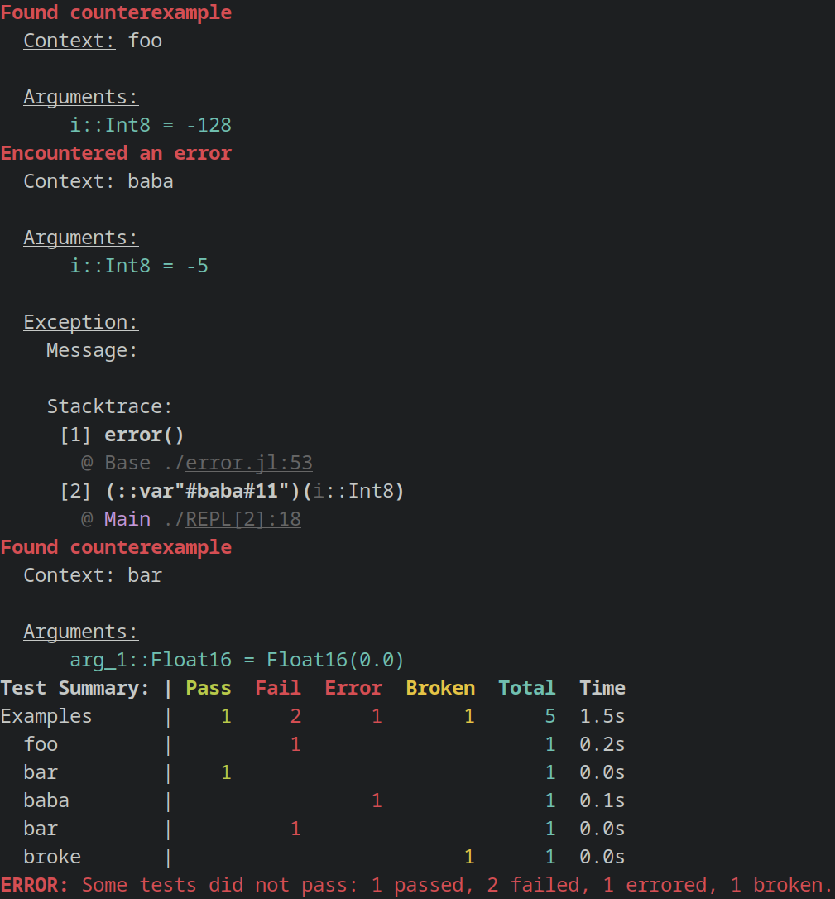

# Supposition.jl

[](https://github.com/Seelengrab/Supposition.jl/actions/workflows/CI.yml?query=branch%3Amain)
[](https://github.com/Seelengrab/Supposition.jl/actions/workflows/nightly.yml?query=branch%3Amain)
[](https://seelengrab.github.io/Supposition.jl/stable)
[](https://seelengrab.github.io/Supposition.jl/dev)
[](https://codecov.io/gh/Seelengrab/Supposition.jl)
[](https://github.com/JuliaTesting/Aqua.jl)

This is a Julia implementation of property based testing. It's been heavily inspired by the testing framework [Hypothesis](https://hypothesis.readthedocs.io/en/latest/).

If you haven't heard of property based testing before or you're not (yet) convinced that it can be a boon, check out [Property-based Testing For The Rest Of Us (or: The Natural Next Step After TDD)](https://arialdomartini.github.io/property-testing)
by Arialdo Martini. The series gives a very gentle introduction as to WHY property based testing is a good thing, and to acknowledge that it's
usually pretty hard to do. The examples used are for C#, but the concepts explained there have their equivalents in Supposition.jl.

## About Supposition.jl

Supposition.jl features the following capabilities:

 * Shrinking of generated examples
   * targeted shrinking, counterexample shrinking and error-based shrinking are all supported
 * Combination of generators into new ones
 * Basic stateful testing
 * Deterministic replaying of previously recorded counterexamples
 * Integration into existing frameworks through `Test.AbstractTestset`

Please check out the [documentation](https://seelengrab.github.io/Supposition.jl/stable) for more information on how to use Supposition.jl!

If you have specific usage questions, ideas for new features or want to show off
your fuzzing skills, please share it on the [Discussions Tab](https://github.com/Seelengrab/Supposition.jl/discussions)!

### Usage

Here's a small usage example:

```julia
julia> using Test, Supposition

julia> @testset "Examples" begin

           # Get a generator for `Int8`
           intgen = Data.Integers{Int8}()

           # Define a property `foo` and feed it `Int8` from that generator
           @check function foo(i=intgen)
               i isa Int
           end

           # Define & run another property, reusing the generator
           @check function bar(i=intgen)
               i isa Int8
           end

           # Define a property that can error
           @check function baba(i=intgen)
               i < -5 || error()
           end

           # Feed a new generator to an existing property
           @check bar(Data.Floats{Float16}())

           # Mark properties as broken
           @check broken=true function broke(b=Data.Booleans())
               b isa String
           end

           # ...and lots more, so check out the docs!
       end
```

Which will produce this output:


